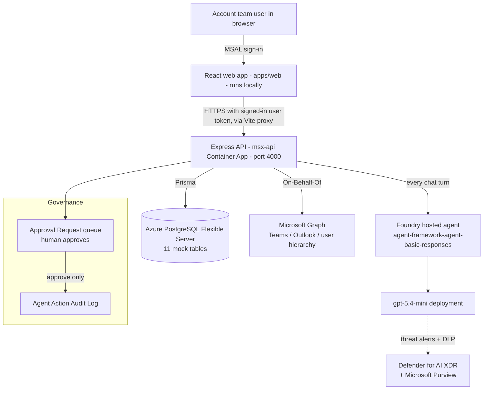

# HANDOFF — Multi-Agent Sales Assistant (Mock)

> **Start here if you are inheriting this project.** This is the single "next owner"
> document. Read Part A to understand the solution, Part B–C for the inventory and who
> needs what, then jump to **Part D (keep it live)** or **Part E (archive & rebuild)**
> depending on what you're doing.

**Prepared for handoff.** Classification: **development / synthetic-mock business data only**.
This solution never touches real MSX, Dataverse, Power Apps/Automate, or real customer
records. Real Microsoft **Entra ID sign-in** and **Microsoft Graph** (Teams/Outlook) are
the only live external integrations, and only for authenticated users.

---

## Table of contents

- **Part A — Understand the solution**
  - A1. What it is, in plain language
  - A2. Architecture at a glance
  - A3. The multi-agent assistant, explained
  - A4. Repository map
- **Part B — The complete inventory** (shared by both options)
  - B1. Azure resources
  - B2. Identity, app registration & RBAC
  - B3. Secrets & configuration (where they live — not the values)
  - B4. External dependencies & licenses
  - B5. Data & the workbook
- **Part C — Ownership & access transfer matrix**
- **Part D — OPTION 1: Keep it live (operate & own)**
- **Part E — OPTION 2: Archive it (reproducible from scratch, torn down for now)**
- **Part F — Known issues, limitations & open items**
- **Part G — Knowledge-transfer session (agenda + sign-off)**
- **Part H — Glossary**
- **Appendix — One-page command cheat sheet**

---

# Part A — Understand the solution

## A1. What it is, in plain language

The **Multi-Agent Sales Assistant** is a self-contained web app that mimics a simplified
**MSX-style workspace** for the Microsoft sales motion: managing sales **opportunities**,
their **milestones**, and the team knowledge around them. It's for **anyone who works an
opportunity on the MSX platform** — Account Executives (AE), Solution Engineers (SE),
Cloud Solution Architects (CSA), Customer Success Account Managers (CSAM), and the wider
account team.

On top of that ordinary app sits a **multi-agent AI assistant**. It can read the data, draft
new opportunities and milestones, and draft Teams/Outlook messages — but **it can never change
data or send a message on its own**. Every action it wants to take becomes an **Approval
Request** that a human must approve first, and **every** governed action is written to an
**audit log**.

Why it exists: opportunities run for months across many people and roles, and context gets
lost during **handoffs** — when a deal passes from pre-sales (AE/SE) to delivery and adoption
(CSA/CSAM), or any time an account changes hands. The assistant centralizes that context and
surfaces "what happened / what's at risk / what to do next" while staying **governed and
auditable**. (The irony that this project needed its own handoff document is not lost on us.)

**One sentence:** a governed, human-in-the-loop, multi-agent assistant over a mock MSX
dataset, deployed on Azure with real Entra identity, Microsoft Graph, and AI security
controls (Defender for AI + Purview DLP).

## A2. Architecture at a glance



**Read-and-propose, never act.** The agent reads context and submits an `ApprovalRequest`
carrying a deferred action. A real change (create/update/delete, or a Teams/Outlook send)
happens **only** when a human approves it via `PATCH /api/approval-requests/:id/approve`,
and is then recorded in `AgentActionAuditLog`.

| Layer | Tech | Where |
| --- | --- | --- |
| Web client | React + TypeScript (Vite), MSAL sign-in | `apps/web` — **runs locally today** (no Azure web resource) |
| API | Node + Express + TypeScript (ESM), Prisma, Zod | `apps/api` → Container App `msx-api` |
| Database | Azure Database for PostgreSQL Flexible Server | `rg-msx-milestone-api`, holds the 11 mock tables |
| Hosted agent | Microsoft Foundry hosted agent (Responses protocol) | `apps/foundry-agent` → Foundry project (Canada East) |
| Model | `gpt-5.4-mini`, one deployment in the Foundry AI account | Foundry / Azure OpenAI |
| Identity | One Entra app registration (MSAL + OBO) | Entra ID |
| Security | Defender for AI + Purview DLP | Subscription / tenant scope |
| Contract | REST + OpenAPI | `openapi/msx-milestone-assistant.openapi.yaml` |

> **Which model serves chat.** Live chat runs on **`gpt-5.4-mini`**, set by
> `AZURE_AI_MODEL_DEPLOYMENT_NAME` in the `azd` env `msx` and provisioned by `azure.yaml`.
> Note that the AI account also still contains an older **`gpt-5-mini`** deployment left over
> from the removed in-app engine. Nothing reads it any more — it is safe to delete, and safe
> to ignore. Confirm what is actually deployed with:
>
> ```powershell
> az cognitiveservices account deployment list -g rg-agent-framework-agent-basic-responses-dev `
>   -n <ai-account> --query "[].{name:name,model:properties.model.name}" -o table
> ```

## A3. The multi-agent assistant, explained

Chat is served by a **single** implementation: the Foundry hosted agent. The repo also
contains an unused Python sketch of the same idea. Knowing which is which prevents a lot of
confusion later.

| # | Implementation | Status | Specialists | Model |
| --- | --- | --- | --- | --- |
| 1 | **Foundry hosted agent** | **Deployed — serves every chat turn** | All five | `gpt-5.4-mini` |
| 2 | **Python reference** (`apps/agent`) | Reference only, not wired up | Three of five | n/a |

**1 — Foundry hosted agent** · `apps/foundry-agent/agent-framework-agent-basic-responses`
The production engine, and a genuine multi-agent orchestrator: `subagents.py` defines five
specialists (`milestone`, `governance`, `dashboard`, `opportunity`, `communications`) and
`main.py` registers each as an `ask_*` delegate tool. Every chat turn routes here. Deployed
via `azd` env `msx`. Its prompt lives in Foundry, **not** in this repo — so changing the
assistant's wording means redeploying the agent, not editing `apps/api`.

**2 — Python reference orchestrator** · `apps/agent` (`orchestrator.py`, `agents.py`,
`tools.py`)
An earlier, partial cut of the design — an orchestrator delegating to milestone, opportunity,
and dashboard specialists only (no governance, no communications). The API never calls it. Keep
it as documentation of the pattern, or delete it; it is not load-bearing.

The README describes a five-specialist design, and the **deployed Foundry agent genuinely
implements all five** — that framing is the current wiring, not a roadmap.

**Governance flow:**

1. Agent **reads context** (`GET /api/opportunities/:id/context`) → audited as `Read`.
2. Agent proposes a change/message → submits an **`ApprovalRequest`** with a deferred
   `action` (`CreateOpportunity`, `UpdateMilestone`, `SendOutlookMail`, `NotifyTeams`, …),
   encoded on the existing `ApprovalRequest.errorMessage` column as `MSX_ACTION::` + JSON
   (no extra tables).
3. A **human decides** on the Approvals page. Approve → executes exactly once + audits.
   Reject / needs-changes → executes nothing.
4. **Every** governed action lands in `AgentActionAuditLog` via `recordAgentAction`.

This gate is the whole point of the POC — **preserve it** in any future change.

## A4. Repository map

```
apps/
  web/            React frontend (MSAL sign-in; runs locally; talks to API via Vite proxy)
  api/            Express backend (all REST routes, governance, Graph, chat)
      src/services/chat/   Foundry proxy + Defender screen
    src/lib/audit.ts     recordAgentAction() — the audit choke point
    tests/               vitest approval-gate + agent-governance suites (`npm test`)
  foundry-agent/  Microsoft Foundry hosted agent (azd project + Bicep infra)
  agent/          Python reference orchestrator + specialists (not wired to the API)
packages/shared/  shared TS types + controlled choice lists (enforced by Zod)
prisma/           schema.prisma (11 models), seed.ts (calls the workbook importer)
scripts/          parseWorkbook.ts, workbookMappings.ts, ensureSeed.ts, smoke-test.ps1
data/             MSX_Mirror_Necessary_Tables_Import_10_More_Entries.xlsx  (source of truth)
openapi/          msx-milestone-assistant.openapi.yaml   (keep in sync with the API)
docs/             architecture.md, security.md, api-test.md, bant-gated-milestone-progression.md
redteam/          adversarial tests that exercise the Defender/Purview controls
.azure/           deployment-plan.md  (the existing one-time REDEPLOY runbook)
Dockerfile, docker-entrypoint.sh   API container image + startup (db push + seed-if-empty)
```

**Existing docs to lean on** (don't duplicate them — this handoff links to them):
- `docs/architecture.md` — design + diagrams + the 11-table model.
- `docs/security.md` — the enable-and-test runbook for Defender for AI + Purview DLP.
- `docs/api-test.md` — endpoint-by-endpoint tests (also the basis for a live demo walkthrough).
- `docs/bant-gated-milestone-progression.md` — BANT-gated milestone design + roadmap.
- `.azure/deployment-plan.md` — a detailed, already-validated **redeploy** runbook for the
  existing resources (reuse this for routine redeploys in Option 1).

---

# Part B — The complete inventory

> Everything a new owner needs to see. **No secret values appear in this document** — both
> `.env` files are gitignored. Where a real value is needed, the doc says *where it lives*
> and gives a command to read it.

## B1. Azure resources

| Item | Value |
| --- | --- |
| Subscription (name) | `ME-MngEnvMCAP758248-t-amandatran-1` |
| Subscription ID | `f850b37c-9bf9-4075-9eb5-43aa2daf6d85` |
| **API resource group** | `rg-msx-milestone-api` — **Canada Central** |
| Container App | `msx-api` (HTTPS ingress, **target port 4000**, single-revision mode, system/managed identity, secret `database-url`, `GRAPH_SEND_MODE=live`) |
| Container Registry (ACR) | `ca34643b5fc3acr` (Container App identity has **AcrPull**; anonymous pull disabled) |
| PostgreSQL | Azure Database for PostgreSQL **Flexible Server** (server host is inside `DATABASE_URL`; holds the 11 mock tables) |
| **Foundry resource group** | `rg-agent-framework-agent-basic-responses-dev` — **Canada East** |
| Foundry project + AI account | AI Foundry project hosting the agent + its `gpt-5.4-mini` model deployment |
| Hosted agent | `agent-framework-agent-basic-responses` (deployed via `azd` env **`msx`**) |
| Agent identity | User-assigned managed identity (Entra Agent ID) created by the Foundry Bicep |
| Monitoring | Application Insights + Log Analytics (created by the Foundry infra) |

**Retrieve the live state (no secrets printed):**

```powershell
az account set --subscription "f850b37c-9bf9-4075-9eb5-43aa2daf6d85"
az group show -n rg-msx-milestone-api --query "{name:name,location:location}" -o json
az containerapp show -g rg-msx-milestone-api -n msx-api `
  --query "{fqdn:properties.configuration.ingress.fqdn,port:properties.configuration.ingress.targetPort,image:properties.template.containers[0].image,revision:properties.latestRevisionName}" -o json
az acr show -g rg-msx-milestone-api -n ca34643b5fc3acr --query "{loginServer:loginServer,adminEnabled:adminUserEnabled}" -o json
```

## B2. Identity, app registration & RBAC

There is **one Entra app registration** doing triple duty. Its **client id / tenant id are
not secret** (a browser SPA exposes them); its **client secret is**.

| Purpose | Detail | Where the id/value lives |
| --- | --- | --- |
| Web sign-in (MSAL) | SPA login for sellers; exposes API scope `access_as_user` | `apps/web/.env` → `VITE_AAD_CLIENT_ID`, `VITE_AAD_TENANT_ID`, `VITE_API_SCOPE` |
| API token validation | API validates Entra bearer tokens (users **and** the agent's app token) | root `.env` → `AAD_TENANT_ID`, `AAD_CLIENT_ID` |
| **Client secret (OBO)** | Powers On-Behalf-Of: Graph sends as the user **and** the Foundry model call runs as the user (this is what makes **Purview DLP enforce**) | root `.env` → `AAD_CLIENT_SECRET` **(secret — never commit)** |
| Agent app allowlist | Optional CSV of app ids allowed to call the API as a service | root `.env` → `AGENT_ALLOWED_APP_IDS` |
| Agent runtime identity | User-assigned managed identity federated onto the Entra Agent ID | Foundry RG (see B1) |

**App registration must have** (see `docs/security.md`): SPA redirect URIs for the web
origins; an exposed API scope `access_as_user`; **Microsoft Graph delegated** permissions
`Chat.ReadWrite`, `ChatMessage.Send`, `Mail.Send`, `User.Read.All` **with admin consent**;
and a delegated **Azure AI / Cognitive Services** (`user_impersonation`) permission (admin
consented) for the Foundry OBO. Each signed-in user needs the **Azure AI User** data-plane
role on the Foundry account.

**Look up the app registration:**

```powershell
# Client id is in apps/web/.env (VITE_AAD_CLIENT_ID). Then:
az ad app show --id <client-id> --query "{name:displayName,appId:appId}" -o json
az ad app permission list --id <client-id> -o table
```

## B3. Secrets & configuration (where they live — not the values)

| Config surface | Contains | Sensitivity |
| --- | --- | --- |
| **root `.env`** (gitignored) | `DATABASE_URL` (with DB password), `AAD_CLIENT_SECRET`, `API_KEY`, `FOUNDRY_AGENT_ENDPOINT`, `DEFENDER_SCREEN_ENDPOINT`, `GRAPH_SEND_MODE`, … | **Secrets** — hand over out-of-band |
| **`apps/web/.env`** (gitignored) | `VITE_AAD_CLIENT_ID`, `VITE_AAD_TENANT_ID`, `VITE_API_SCOPE` | Non-secret ids (still gitignored) |
| **Container App** `msx-api` | secret `database-url`; env `GRAPH_SEND_MODE=live`, `AAD_*`, model/Foundry endpoints | **Secrets** in Azure |
| **azd env `msx`** | Foundry project/endpoint/connection settings | Some secret — never print |
| `.env.example` (committed) | Safe placeholders + inline docs for every variable | Safe — the reference |

`.env.example` is the authoritative, commented list of every variable — read it first.

**Read the live Container App config (names only, values redacted by Azure for secrets):**

```powershell
az containerapp show -g rg-msx-milestone-api -n msx-api --query "properties.template.containers[0].env[].name" -o tsv
az containerapp secret list -g rg-msx-milestone-api -n msx-api --query "[].name" -o tsv
```

## B4. External dependencies & licenses

| Dependency | What it's for | Cost / licensing note |
| --- | --- | --- |
| Azure subscription | Hosts all resources | Pay-as-you-go on the sub above |
| Microsoft Foundry project + model | The hosted agent + its `gpt-5.4-mini` deployment | Per-token model billing; regional to Canada East |
| Microsoft Entra ID | Sign-in + OBO | Included with the tenant |
| Microsoft Graph | Teams/Outlook sends, user hierarchy | Needs admin-consented delegated scopes |
| **Microsoft Defender for Cloud — AI plan** | Jailbreak / data-leak alerts on the AI account | **Standard tier is billed** (30-day free trial). Toggle `ENABLE_DEFENDER_FOR_AI` / `az security pricing`. |
| **Microsoft Purview (DLP for AI)** | PII/PCI DLP on model prompts/responses | **Requires a Purview license**; alerts surface in the Purview portal |
| Node.js 18+ / npm | Build & run | Free |
| Docker | Build the API image | Free |
| Azure CLI + `azd` + `azure.ai.agents` extension | Deploy | Free |

## B5. Data & the workbook

- The dataset is **not hardcoded**. It is imported from
  `data/MSX_Mirror_Necessary_Tables_Import_10_More_Entries.xlsx` (one sheet per table).
- Pipeline: **Excel → `scripts/parseWorkbook.ts` → JSON → Prisma `connect` → PostgreSQL**,
  with column→field maps in `scripts/workbookMappings.ts`.
- The container **auto-seeds when the DB is empty** (`scripts/ensureSeed.ts` via
  `docker-entrypoint.sh`), so runtime data survives restarts and is only loaded once.
- **Exactly 11 tables — never add tables:** Opportunity, OpportunityMilestone,
  MilestoneStatusHistory, AiMilestoneRecommendation, ApprovalRequest, CollaborationNote,
  DealTeamMember, AgentNotification, AgentRunLog, AgentActionAuditLog, DashboardMetricSnapshot.

---

# Part C — Ownership & access transfer matrix

Give the new owner these, then confirm each is verified. "Owner" = the person/team taking
over; "You" = the departing author.

| # | Item | Action to transfer | Verified |
| --- | --- | --- | --- |
| 1 | Azure subscription access | Add Owner/Contributor at the subscription (or both RGs) for the new owner | ☐ |
| 2 | Both resource groups | Confirm they can read/deploy to `rg-msx-milestone-api` and `rg-agent-framework-agent-basic-responses-dev` | ☐ |
| 3 | ACR push/pull | Owner can `az acr login` and push to `ca34643b5fc3acr` via their identity | ☐ |
| 4 | Entra app registration | Add owner as an **Application owner** in Entra; hand over the **client secret** out-of-band (or have them rotate it — see D6) | ☐ |
| 5 | Foundry project + `azd` env `msx` | Owner can `azd env select msx` and `azd deploy`; has **Azure AI User** on the account | ☐ |
| 6 | Secrets bundle | Deliver root `.env` + `apps/web/.env` via a secure channel (Key Vault, 1-password-style, or encrypted) — **not** email/chat/commit | ☐ |
| 7 | The workbook | Confirm `data/*.xlsx` is present in the repo (it is the data source) | ☐ |
| 8 | Defender/Purview admin | Point owner to whoever holds Security/Compliance admin to keep Defender + Purview enabled | ☐ |
| 9 | GitHub repo | Transfer/add maintainer on `amandatranMS/Project` | ☐ |
| 10 | This document + `docs/` | Owner has read `HANDOFF.md`, `docs/security.md`, `.azure/deployment-plan.md` | ☐ |

---

# Part D — OPTION 1: Keep it live (operate & own)

Use this when a team/person takes over the **running** solution.

## D1. Access handover checklist
Complete **Part C** first. The owner should end up able to: sign in to the web app, call the
live API, redeploy the API image, redeploy the Foundry agent, and read logs/metrics.

## D2. Run & verify locally (proves the owner's setup works)

```powershell
# 1. Install + generate client + push schema + load the workbook (needs DATABASE_URL in .env)
npm run setup

# 2. Fastest signal — governance tests. No database, no Azure, no .env required.
npm test

# 3. Run API (:4000) + web (:5173) together
npm run dev
# open http://localhost:5173  — confirm the mock banner, sign-in, dashboard, approvals
```

> `npm test` is the quickest way to prove a checkout is sane: it runs the approval-gate
> suites in under a second with everything mocked. If it fails, the human-in-the-loop
> guarantee described in Part A is broken — treat that as a release blocker, not a flake.

Health check against the **live** API:

```powershell
$fqdn = az containerapp show -g rg-msx-milestone-api -n msx-api --query properties.configuration.ingress.fqdn -o tsv
curl "https://$fqdn/api/health"   # expect HTTP 200  { "success": true, "data": { "status": "ok" } }
```

Optional deeper check: `pwsh scripts\smoke-test.ps1 -BaseUrl https://$fqdn -ApiKey <key>`.

## D3. Redeploy runbook (routine updates)

**A full, already-validated redeploy runbook exists at `.azure/deployment-plan.md`.** Use it
for anything non-trivial. The essentials:

**API (new image → new revision):**
```powershell
az account set --subscription "f850b37c-9bf9-4075-9eb5-43aa2daf6d85"
$Tag   = "deploy-" + (Get-Date).ToUniversalTime().ToString("yyyyMMddHHmmss")
$Image = "ca34643b5fc3acr.azurecr.io/msx-api:$Tag"
az acr login -n ca34643b5fc3acr
docker build --pull --build-arg "CACHEBUST=$Tag" -t $Image .   # or: az acr build -r ca34643b5fc3acr -t msx-api:$Tag .
docker push $Image
az containerapp update -g rg-msx-milestone-api -n msx-api --image $Image
```
Do **not** pass flags that change secrets, env vars, ingress, port, identity, scale, or
revision mode. Wait for the new revision to be Running/Healthy, then re-check `/api/health`.

**Foundry hosted agent (code-only):**
```powershell
cd apps\foundry-agent\agent-framework-agent-basic-responses
azd env select msx
azd deploy agent-framework-agent-basic-responses
```
Do **not** run `azd up` / `azd provision` here — infra already exists (provisioning proposes a
duplicate project). Capture the new agent version; verify a read-only prompt still works.

**Web:** builds and runs locally (`npm run build -w @msx/web`, `npm run dev:web`). See the
open item in Part F about hosting it.

## D4. Operate: monitoring, logs, common failures → fixes, rollback

**Where to look:**
```powershell
# API container logs (live tail)
az containerapp logs show -g rg-msx-milestone-api -n msx-api --follow
# Revision list / health
az containerapp revision list -g rg-msx-milestone-api -n msx-api -o table
```
Foundry agent traces + model metrics are in **Application Insights** in the Foundry RG.
Security alerts: **Defender XDR** (AI threats) and the **Purview portal** (DLP/PII/PCI).

**Common failures and the first thing to check:**

| Symptom | Likely cause | First fix |
| --- | --- | --- |
| `/api/health` 5xx or crash loop | Bad/expired `DATABASE_URL`, DB firewall, or startup schema error | Check container logs; verify the `database-url` secret and that the client IP / "Allow Azure services" is permitted on the Postgres server |
| Web can't reach API / 401 | MSAL config or expired **client secret**; wrong `VITE_API_SCOPE` | Verify `apps/web/.env`; check the app registration secret hasn't expired (D6) |
| Chat returns an error | Foundry endpoint/version, model quota, or OBO permission missing | Check `FOUNDRY_AGENT_ENDPOINT`; confirm **Azure AI User** role + admin-consented AI permission |
| Teams/Outlook send fails | `GRAPH_SEND_MODE` or missing admin-consented Graph scopes | Confirm scopes + admin consent (B2); set `GRAPH_SEND_MODE=simulate` to test without sending |
| No Defender/Purview alerts | Plan/screen disabled, or model call not running as the user | See `docs/security.md` Parts 1–2 (needs OBO) |

**Rollback (API):** redeploy the previously-good image on the same app — never reset the DB.
```powershell
az containerapp update -g rg-msx-milestone-api -n msx-api --image <previous-image-ref>
```
**Rollback (agent):** reactivate the previous healthy Foundry agent version via the Foundry
version-management path. Full rollback + stop-conditions are in `.azure/deployment-plan.md` §12.

## D5. Cost & scaling

- **Main cost drivers:** the model deployments (per token — `gpt-5.4-mini` carries the live
  traffic), Defender for AI (**Standard, billed**), the PostgreSQL Flexible Server (always-on
  compute + storage), and the Container App (scales to a small floor). Purview needs a
  **license**.
- **To trim cost while keeping it live:** ensure the Container App min-replicas is low; pick
  the smallest viable Postgres SKU; keep the model deployment modest. Check current spend:
```powershell
  az consumption usage list --top 20 -o table
```
- **Scaling up** later: raise Container App replicas/limits and the Postgres SKU; the app is
  stateless except for the DB.

## D6. Security & governance you must preserve

1. **Human-in-the-loop gate** — agents submit `ApprovalRequest`s; only human approval
   executes/sends. Never let an agent mutate or send directly.
2. **Audit everything** — every governed action and Graph read calls `recordAgentAction`
   (`apps/api/src/lib/audit.ts`).
3. **Mock-only business data** — never persist real Graph data into the 11 tables; never
   connect real MSX/Dataverse.
4. **Response envelope** — keep `{ success, data }` / `{ success, error }` (the web client
   unwraps `.data`).
5. **Rotate the client secret** on handover: create a new secret on the app registration,
   put it in the API's `AAD_CLIENT_SECRET` (root `.env` locally / Container App secret in
   Azure), then remove the old one so the departing author's copy stops working.
   **Caveat:** `MSX_SESSION_SECRET` (which signs the session handles the hosted agent uses
   for its tool callbacks) **falls back to `AAD_CLIENT_SECRET` when unset**, so rotating the
   client secret silently invalidates in-flight session handles. Set `MSX_SESSION_SECRET` to
   its own dedicated random value to decouple the two before you rotate.
6. **Keep Defender for AI + Purview DLP on** if the compliance story matters (see
   `docs/security.md`).

## D7. Routine maintenance calendar

| Cadence | Task |
| --- | --- |
| Monthly | Check the **client-secret expiry** and Defender/Purview alerts; skim container logs |
| Monthly | `npm outdated` / dependency + base-image (`node:20-bookworm-slim`) refresh |
| Quarterly | Redeploy a rebuilt image (picks up OS/security patches); re-run the smoke test |
| On workbook change | `npm run import-workbook` locally, or let the container reseed an empty DB |
| Before any schema change | `npm run prisma:generate` + `npm run db:push`, keep the 11-table rule |

---

# Part E — OPTION 2: Archive it (reproducible from scratch, torn down for now)

Use this when you want to **shut the solution down to stop cost** but be able to **rebuild it
exactly** later. Do **E1 (capture)** before **E3 (teardown)**.

## E1. Capture-before-teardown checklist

The code + IaC already reproduce the app; the only things that don't live in git are secrets,
environment-specific ids, and any runtime data you care about.

| Capture | How | Store where |
| --- | --- | --- |
| Source of truth | Confirm the repo is fully committed & pushed (`git status` clean; it is) | GitHub `amandatranMS/Project` |
| The workbook | Ensure `data/MSX_Mirror_Necessary_Tables_Import_10_More_Entries.xlsx` is committed (it is the data) | In-repo |
| Secrets / ids | Save `root .env` + `apps/web/.env` (client id, tenant id, API scope, DB URL shape, endpoints) | Secure vault (Key Vault / password manager) |
| Container config snapshot | `az containerapp show ... -o json`, env-name list, secret-name list | Vault / archive |
| azd environment | `azd env get-values` (from the agent dir) — **contains secrets, store securely** | Vault |
| App registration facts | client id, tenant id, exposed scope, Graph + AI permissions, redirect URIs | Vault / this doc's Part B2 |
| (Optional) runtime data | If any human-created records matter: `pg_dump` the DB | Vault / archive |

```powershell
# Snapshot the API app config (no secret values printed)
az containerapp show -g rg-msx-milestone-api -n msx-api -o json > archive\msx-api.json
# Optional data export (only if you care about post-seed runtime rows)
pg_dump "<DATABASE_URL>" -Fc -f archive\msx-data.dump
```

## E2. Rebuild-from-zero runbook

Everything below re-creates the solution in a **fresh** environment. This is the scenario
where `azd provision` **is** allowed (unlike the redeploy runbook).

**Prerequisites:** Azure CLI + `azd` (`azd ext install microsoft.foundry`), Docker, Node 18+, an
Azure subscription, and a tenant where you can admin-consent Graph permissions.

**Step 1 — Foundry project, model, identity, monitoring (IaC):**
```powershell
cd apps\foundry-agent\agent-framework-agent-basic-responses
azd auth login
azd env new msx                      # or any name
azd up                               # provisions Foundry project + gpt-5.4-mini + UAMI + App Insights, then deploys the agent
```
This runs the Bicep in `apps/foundry-agent/infra` (`main.bicep`) and prints the agent's
Responses endpoint — save it as `FOUNDRY_AGENT_ENDPOINT`.

**Step 2 — PostgreSQL:**
```powershell
az group create -n rg-msx-milestone-api -l canadacentral
az postgres flexible-server create -g rg-msx-milestone-api -n <server> -l canadacentral `
  --admin-user <user> --admin-password <pw> --tier Burstable --sku-name Standard_B1ms --version 16
az postgres flexible-server db create -g rg-msx-milestone-api -s <server> -d msx
az postgres flexible-server firewall-rule create -g rg-msx-milestone-api -n <server> `
  --rule-name allow-azure --start-ip-address 0.0.0.0 --end-ip-address 0.0.0.0   # "Allow Azure services"
# DATABASE_URL = postgresql://<user>:<url-encoded-pw>@<server>.postgres.database.azure.com:5432/msx?sslmode=require
```

**Step 3 — Entra app registration** (see `docs/security.md` for exact steps): register the
app; add SPA redirect URIs; expose API scope `access_as_user`; add **Graph delegated**
`Chat.ReadWrite`, `ChatMessage.Send`, `Mail.Send`, `User.Read.All` + a delegated **Azure AI**
`user_impersonation`; **grant admin consent**; create a **client secret**; assign each user
**Azure AI User** on the Foundry account. Record client id / tenant id.

**Step 4 — API container (ACR + Container App):**
```powershell
az acr create -g rg-msx-milestone-api -n <acr> --sku Basic
az acr build -r <acr> -t msx-api:v1 .                      # builds the Dockerfile
az containerapp env create -g rg-msx-milestone-api -n msx-env -l canadacentral
az containerapp create -g rg-msx-milestone-api -n msx-api `
  --environment msx-env --image <acr>.azurecr.io/msx-api:v1 `
  --target-port 4000 --ingress external --system-assigned `
  --secrets database-url="<DATABASE_URL>" `
  --env-vars DATABASE_URL=secretref:database-url PORT=4000 GRAPH_SEND_MODE=simulate `
             AAD_TENANT_ID=<t> AAD_CLIENT_ID=<c> AAD_CLIENT_SECRET=secretref:... `
             FOUNDRY_AGENT_ENDPOINT=<from step 1>
# grant the app's managed identity AcrPull on <acr>
```
The container entrypoint runs `prisma db push` and **seeds from the workbook when empty**, so
the 11 tables + mock data appear automatically on first boot. Verify `/api/health`.

**Step 5 — Web (local, or host it):** set `apps/web/.env` (client id, tenant id, API scope)
and `API_PROXY_TARGET=https://<api-fqdn>`; run `npm run dev:web`. (Hosting the web app is an
open item — see Part F.)

**Step 6 — Security (optional but part of the story):** enable Defender for AI + Purview DLP
per `docs/security.md`.

## E3. Teardown runbook (drive cost to ~zero)

Do this **after E1**. Order matters only for your own safety (capture first).

```powershell
# 1. Foundry project + agent + model + identity + monitoring (from the agent dir)
cd apps\foundry-agent\agent-framework-agent-basic-responses
azd down --force --purge            # deletes what azd provisioned

# 2. API resource group (Container App + ACR + Postgres)  — DELETES DATA
az group delete -n rg-msx-milestone-api --yes --no-wait

# 3. If azd left the Foundry RG, remove it too
az group delete -n rg-agent-framework-agent-basic-responses-dev --yes --no-wait

# 4. Turn off the billed Defender for AI plan
az security pricing create -n AI --tier Free

# 5. Entra app registration — delete only if not shared; otherwise remove the client secret
az ad app delete --id <client-id>
```
Purview: remove the DLP policy / release the license per your tenant's process. Confirm zero
resources remain:
```powershell
az resource list --query "[?resourceGroup=='rg-msx-milestone-api' || resourceGroup=='rg-agent-framework-agent-basic-responses-dev']" -o table
```

## E4. Prove it can be rebuilt (do this before you rely on the archive)

A reproducible archive is only real if you've tested it. Ideally, **once**, run E2 into a
throwaway environment (`azd env new msx-test`, a temp RG) and confirm `/api/health` +
sign-in + one approval flow, then tear that test down (E3). At minimum, confirm: repo pushed &
clean, workbook committed, secrets saved to a vault, `.env.example` current, and this document
saved alongside the archive.

---

# Part F — Known issues, limitations & open items

Be upfront with the next owner — a good handoff surfaces the rough edges.

| Area | Item |
| --- | --- |
| **Web hosting** | The React app **runs locally only** — there is no Azure web resource. For a fully cloud handoff, host it as an Azure **Static Web App** or a second Container App and point it at the API FQDN. |
| **Unused Python reference agent** | `apps/agent` is a standalone Python sketch (three of five specialists, no governance or communications). Nothing calls it. Keep it as documentation of the pattern or delete it — it is not load-bearing. |
| **Automated tests** | `npm test` runs 11 approval-gate tests (`apps/api/tests/approvalGate.test.ts`) — fully mocked, so no database or Azure, ~2 seconds. They pin the gate itself: reject and needs-changes execute nothing; approve executes exactly once and audits it; double-approve and tampered payloads are refused. The suite was mutation-verified (deliberately broken to confirm it fails). **Not covered:** the web app, the Foundry agent, and true end-to-end integration. The Foundry agent has its own `pytest` file for session handles. |
| **Client secret lifetime** | OBO depends on `AAD_CLIENT_SECRET`; it **expires**. Rotate on handover and track the expiry (D6/D7). |
| **Graph = live** | `GRAPH_SEND_MODE=live` on the Container App means real Teams/Outlook sends. Opportunity-broadcast can message **every eligible tenant member** — test with `simulate`. |
| **ACR admin** | ACR admin user was left enabled per an earlier instruction; prefer identity-based `AcrPull` and consider disabling admin. |
| **Costs while idle** | Defender for AI (Standard) and Postgres bill even with no traffic. Option 2 exists precisely to stop this. |
| **Single subscription/tenant** | Everything lives in one intern subscription + the Foundry tenant. A permanent home may require moving resources and re-consenting Graph. |

---

# Part G — Knowledge-transfer session (agenda + sign-off)

A 60–90 min live walkthrough closes most handoff gaps. Suggested agenda:

1. **(10 min)** Problem + the governance idea (Part A1, A3) — demo one approval + audit.
2. **(15 min)** Live demo of the golden path (dashboard → opportunity → agent draft →
   approve → Teams/Outlook); use `docs/api-test.md` for the endpoint-level equivalent.
3. **(15 min)** Architecture + repo tour (Part A2/A4); where audit happens.
4. **(15 min)** Inventory + access (Parts B/C) — hand over secrets securely, add access, and
   **rotate the client secret together**.
5. **(15 min)** Operate **or** archive: walk Part D (redeploy + logs + rollback) or Part E
   (rebuild + teardown), whichever applies.
6. **(10 min)** Known issues (Part F) + Q&A.

**Sign-off:** the new owner can (a) run it locally, (b) hit the live `/api/health`, (c)
redeploy the API and the agent (Option 1) **or** rebuild from zero in a test env (Option 2),
(d) find logs and the audit log, and (e) has all secrets + access from Part C.

---

# Part H — Glossary

- **Opportunity / Milestone** — the core mock MSX business records.
- **Approval Request** — a queued, human-decided action the agent proposes; the gate.
- **Governed action** — any agent action that changes data or sends a message; always
  approval-gated and audited.
- **`recordAgentAction`** — the single audit function every governed action calls.
- **Foundry hosted agent** — the deployed Microsoft Foundry agent; it serves all chat.
- **OBO (On-Behalf-Of)** — the API exchanges the user's token so Graph/model calls run **as
  the signed-in user**, which is what makes Purview DLP enforce.
- **`azd` env `msx`** — the Azure Developer CLI environment that deploys the Foundry agent.
- **The 11 tables** — the fixed mock schema; never add tables.

---

# Appendix — One-page command cheat sheet

```powershell
# --- Local dev ---
npm run setup                     # install + prisma generate + db push + import workbook
npm run dev                       # API :4000 + web :5173
npm test                          # approval-gate governance suites (mocked; no DB/Azure needed)
npm run build                     # build shared + api + web
npm run import-workbook           # reset tables + reload from the Excel workbook

# --- Point at the subscription ---
az account set --subscription "f850b37c-9bf9-4075-9eb5-43aa2daf6d85"

# --- Health / inspect (Option 1) ---
$fqdn = az containerapp show -g rg-msx-milestone-api -n msx-api --query properties.configuration.ingress.fqdn -o tsv
curl "https://$fqdn/api/health"
az containerapp logs show -g rg-msx-milestone-api -n msx-api --follow

# --- Redeploy API (Option 1) ---
$Tag="deploy-"+(Get-Date).ToUniversalTime().ToString("yyyyMMddHHmmss"); $Image="ca34643b5fc3acr.azurecr.io/msx-api:$Tag"
az acr build -r ca34643b5fc3acr -t "msx-api:$Tag" .
az containerapp update -g rg-msx-milestone-api -n msx-api --image $Image

# --- Redeploy Foundry agent (Option 1) ---
cd apps\foundry-agent\agent-framework-agent-basic-responses; azd env select msx; azd deploy agent-framework-agent-basic-responses

# --- Rebuild from zero (Option 2) ---  see Part E2
# --- Teardown (Option 2) ---
cd apps\foundry-agent\agent-framework-agent-basic-responses; azd down --force --purge
az group delete -n rg-msx-milestone-api --yes --no-wait
az security pricing create -n AI --tier Free
```

_Full, validated redeploy + rollback detail lives in `.azure/deployment-plan.md`. Security
enable/test steps live in `docs/security.md`. Architecture detail lives in
`docs/architecture.md`._
