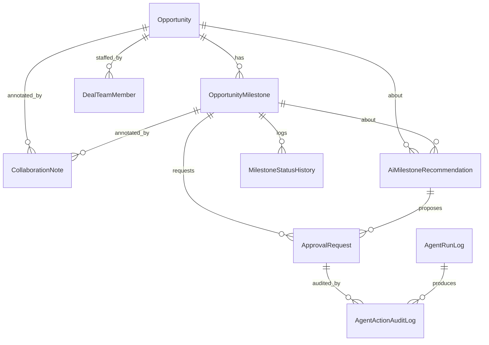
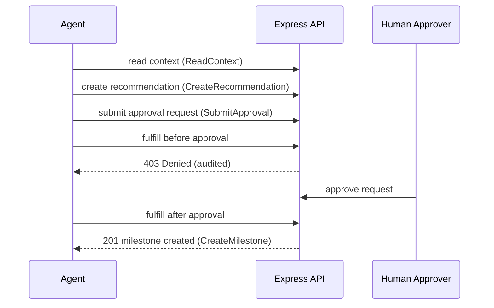

# Architecture — Multi-Agent Sales Assistant (Mock)

## Purpose & scope

A synthetic, self-contained proof of concept that recreates a simplified
**MSX-style workspace** for the Microsoft sales motion — for **anyone who works an
opportunity on the MSX platform** (Account Executives, Solution Engineers, Cloud
Solution Architects, Customer Success Account Managers, and the wider account team).
It manages **opportunities**
(parent business records) and **opportunity milestones** (the central working
records), and demonstrates a **governed agent pattern**: agents can read context,
make recommendations, and request approval, but a human must approve before any
new milestone record is created — and every agent action is audited.

> Not connected to real MSX, Dataverse, Power Apps, Power Automate, or any
> production Microsoft system. All data is fictional.

## Why this exists

The project was originally planned on Power Apps + Dataverse but that path is
blocked by DLP restrictions in the environment. It is re-implemented as a
full-stack web application with its own backend, database, and UI.

## Technology stack

| Layer        | Technology                          |
| ------------ | ----------------------------------- |
| Frontend     | React + TypeScript (Vite)           |
| Backend      | Node.js + Express + TypeScript      |
| Database     | SQLite                              |
| ORM          | Prisma                              |
| Validation   | Zod                                 |
| API style    | REST + OpenAPI 3.0                  |
| Styling      | Hand-written professional CSS       |

## Monorepo layout

```
apps/
  web/     React frontend (Vite)
  api/     Express backend (REST API)
packages/
  shared/  Shared TypeScript types / allowed-value unions
prisma/
  schema.prisma   11-table data model
  seed.ts         synthetic seed data
openapi/
  msx-milestone-assistant.openapi.yaml
docs/
  api-test.md, demo-script.md, architecture.md
```

npm **workspaces** tie the packages together. The web app talks to the API through
a Vite dev proxy (`/api` → `http://localhost:4000`).

## Data model — 11 tables only

Risk, blocker, competitor, and partner information is intentionally **embedded**
into `Opportunity` / `OpportunityMilestone` rather than modeled as separate tables,
to keep the POC manageable. There is deliberately **no** Account, Partner,
Competitor, Milestone Blocker, or Milestone Risk Assessment table.

1. **Opportunity** — parent record; embeds partner + competitor + top-level risk.
2. **OpportunityMilestone** — central working record; embeds blocker + risk detail.
3. **MilestoneStatusHistory** — status transition audit trail.
4. **AiMilestoneRecommendation** — agent-generated advice (no side effects).
5. **ApprovalRequest** — human-in-the-loop gate.
6. **CollaborationNote** — notes on opportunity/milestone.
7. **DealTeamMember** — people on an opportunity.
8. **AgentNotification** — messages surfaced from agent activity.
9. **AgentRunLog** — one row per agent execution.
10. **AgentActionAuditLog** — every concrete agent action (governance).
11. **DashboardMetricSnapshot** — precomputed dashboard metrics.



## Agent governance model (core design)

The API enforces the rules — the UI is just a client.

- **Read** context: `GET /api/agent/context/:opportunityId` → audited `ReadContext`.
- **Recommend**: `POST /api/agent/recommendations` → audited `CreateRecommendation`.
- **Request approval**: `POST /api/agent/approvals` → audited `SubmitApproval`.
- **Create milestone**: only via `POST /api/agent/approvals/:id/fulfill` **after** a
  human approves. Attempting to fulfill a non-approved request returns **403** and
  is audited as `Denied`.



Every branch writes to `AgentActionAuditLog`, so the full history —
`ReadContext → CreateRecommendation → SubmitApproval → Denied → CreateMilestone` —
is queryable via `GET /api/agent/audit` and visible on the Agent Audit Log page.

## Cloud security governance (Defender + Purview)

The app-level approval + audit gate above is complemented by real Microsoft cloud
controls on the **AI model interactions** (never on the mock tables). See
[security.md](security.md) for the enable/test runbook.

- **Microsoft Defender for Cloud (→ Defender XDR)** attaches to the shared
  Foundry `AIServices` account, so it covers **both** engines — the Foundry hosted
  agent (`services/chat/foundryProxy.ts`) and the direct Azure OpenAI engine
  (`orchestrator.ts` → `toolLoop.ts`). Enabled via the `enableDefenderForAI` Bicep
  param.
- **Microsoft Purview DLP** governs the **direct engine only** — Purview does not
  cover Foundry agents yet. `toolLoop.ts` stamps each direct call with the signed-in
  user's `user_security_context` (built in `lib/requestContext.ts`), which is what
  lets Purview classify and enforce per real user.

## Validation & error handling

- All request bodies are validated with **Zod** schemas (`apps/api/src/schemas.ts`).
- SQLite has no native enums, so status/type fields are Strings; their allowed
  values are the single source of truth in `packages/shared` and enforced by Zod.
- A central error handler returns `400` for validation errors, `4xx` for
  `HttpError`, and `500` otherwise.

## Running locally

```bash
npm run setup   # install + prisma generate + db push + seed
npm run dev     # api on :4000, web on :5173
```

See `docs/api-test.md` for endpoint-by-endpoint tests and `docs/demo-script.md` for
a guided walkthrough.
