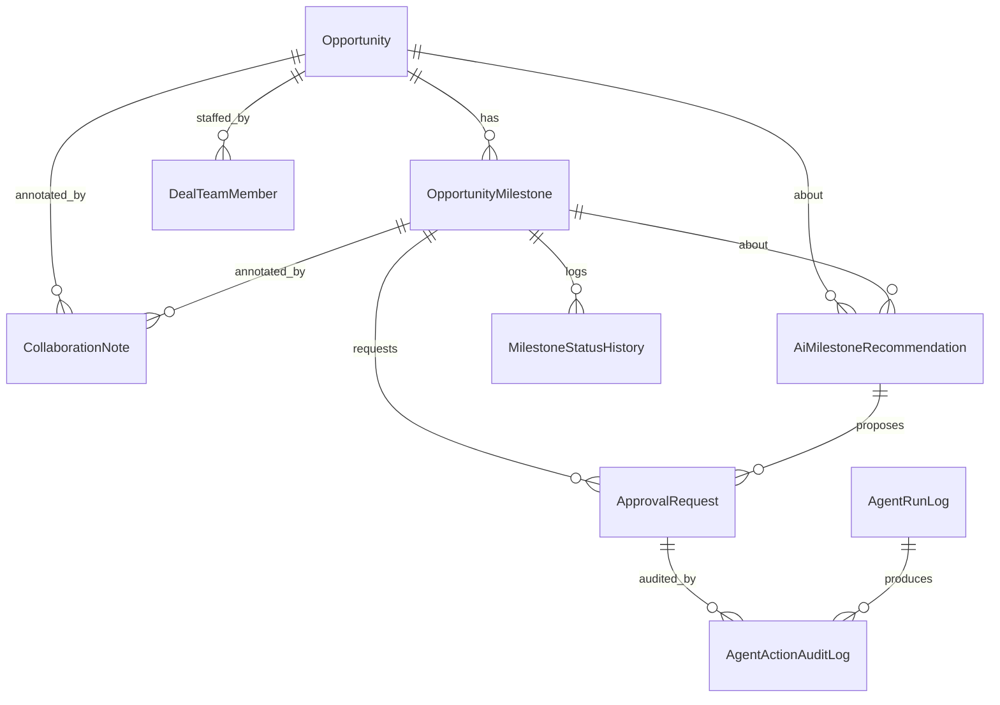
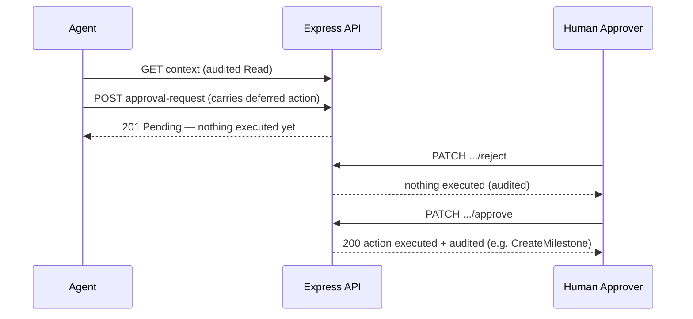

# Architecture — Multi-Agent Sales Assistant (Mock)

## Purpose & scope

A synthetic, self-contained proof of concept that recreates a simplified
**MSX-style workspace** for the Microsoft sales motion — for **anyone who works an
opportunity on the MSX platform** (Account Executives, Solution Engineers, Cloud
Solution Architects, Customer Success Account Managers, and the wider account team).
It manages **opportunities**
(parent business records) and **opportunity milestones** (the central working
records), and demonstrates a **governed agent pattern**: agents can read context,
make recommendations, and request approval, but a human must approve before any data
change or message is executed — and every agent action is audited.

> Not connected to real MSX, Dataverse, Power Apps, Power Automate, or any
> production Microsoft system. All data is fictional.

## Why this exists

The project was originally planned on Power Apps + Dataverse but that path is
blocked by DLP restrictions in the environment. It is re-implemented as a
full-stack web application with its own backend, database, and UI.

## Technology stack

| Layer        | Technology                                          |
| ------------ | --------------------------------------------------- |
| Frontend     | React + TypeScript (Vite)                           |
| Backend      | Node.js + Express + TypeScript (ESM)                |
| Database     | Azure Database for PostgreSQL Flexible Server       |
| ORM          | Prisma                                              |
| Validation   | Zod                                                 |
| API style    | REST + OpenAPI 3.0                                  |
| Identity     | Microsoft Entra ID (MSAL) + Microsoft Graph         |
| Styling      | Hand-written professional CSS                       |

## Monorepo layout

```
apps/
  web/     React frontend (Vite)
  api/     Express backend (REST API) — layered routes → controllers → services
  foundry-agent/   Microsoft Foundry hosted agent (the default chat engine)
packages/
  shared/  Shared TypeScript types / allowed-value unions
prisma/
  schema.prisma   11-table data model
  seed.ts         calls the workbook importer (data is not hardcoded)
scripts/
  parseWorkbook.ts, workbookMappings.ts   Excel → Prisma import pipeline
openapi/
  msx-milestone-assistant.openapi.yaml
docs/
  api-test.md, architecture.md, security.md, bant-gated-milestone-progression.md,
  stakeholder-feedback-roadmap.md
```

npm **workspaces** tie the packages together. The web app talks to the API through
a Vite dev proxy (`/api` → `http://localhost:4000`).

Records are **not** hardcoded: they are imported from the Excel workbook
(`data/*.xlsx`) via `scripts/parseWorkbook.ts`, which `prisma/seed.ts` simply calls.
See the README's *Data import pipeline* section for details.

## Data model — 11 tables only

Risk, blocker, competitor, and partner information is intentionally **embedded**
into `Opportunity` / `OpportunityMilestone` rather than modeled as separate tables,
to keep the POC manageable. There is deliberately **no** Account, Partner,
Competitor, Milestone Blocker, or Milestone Risk Assessment table.

1. **Opportunity** — parent record; embeds partner + competitor + top-level risk.
2. **OpportunityMilestone** — central working record; embeds blocker + risk detail.
3. **MilestoneStatusHistory** — status transition audit trail.
4. **AiMilestoneRecommendation** — agent-generated advice (no side effects).
5. **ApprovalRequest** — human-in-the-loop gate.
6. **CollaborationNote** — notes on opportunity/milestone.
7. **DealTeamMember** — people on an opportunity.
8. **AgentNotification** — messages surfaced from agent activity.
9. **AgentRunLog** — one row per agent execution.
10. **AgentActionAuditLog** — every concrete agent action (governance).
11. **DashboardMetricSnapshot** — precomputed dashboard metrics.



## Agent governance model (core design)

The API enforces the rules — the UI is just a client. Agents may **read** context and
**propose** changes, but they can never mutate data or send a message directly. Every
governed action is submitted as an **`ApprovalRequest`** and only executed when a human
approves it.

- **Read** context: `GET /api/opportunities/:id/context` → audited `Read`.
- **Recommend**: `POST /api/recommendations` → surfaced as an `AiMilestoneRecommendation`.
- **Request approval**: `POST /api/approval-requests`, optionally carrying a deferred
  `action` (`CreateMilestone`, `CreateOpportunity`, `SendOutlookMail`, `NotifyTeams`,
  `UpdateMilestone`, `UpdateOpportunity`, `UpdateDealTeamMember`, `DeleteMilestone`).
  The action is encoded onto the existing `ApprovalRequest.errorMessage` column
  (`MSX_ACTION::` + JSON) — **no extra tables or columns**.
- **Execute**: only via `PATCH /api/approval-requests/:id/approve`. Approving executes
  the deferred action (audited by its kind) or, for a recommendation-backed request,
  performs the mock milestone writeback (audited as `CreateMilestone`).
- **`reject` / `needs-changes`** never execute anything (`needs-changes` preserves the
  encoded action for a later approval).



Every governed action is written to `AgentActionAuditLog` via `recordAgentAction`
(`apps/api/src/lib/audit.ts`), so the full history is queryable via
`GET /api/agent-action-audit-logs` and visible on the Agent Audit Log page.

### Who sees what

Business records are shared; agent activity is not. Everyone sees the same
opportunities, milestones, notes, and deal teams. But an approval request is the
record of what *your* agent turn proposed on your behalf, so `ApprovalRequest`
and `AgentActionAuditLog` are scoped to the signed-in user.

- Both tables carry an `ownerId` (the user's Entra `oid`). Reads are filtered to
  **your rows plus unowned rows**; unowned means seeded or system activity, which
  stays shared.
- The filter also applies where these rows hang off a shared parent — the
  opportunity context read, the milestone detail, and the recommendation detail
  all scope their nested `approvalRequests` / `auditLogs`.
- Only the owner may decide their own request. That matters more than a read:
  approving is what actually fires the send or write, so deciding someone else's
  request would take a real action under their name. It returns 404 (not 403) so
  an id probe can't confirm another user's approval exists.
- `pendingApprovals` on the dashboard is scoped the same way, so the tile agrees
  with the Approvals tab.
- The hosted agent authenticates with a **service** credential and has no user
  identity of its own. It echoes the user's `x-msx-session` handle on every
  callback, and the API unseals the `oid` from it to stamp the owner as rows are
  created. Ownership is never inferred from timing — that would mis-attribute
  rows whenever two people chat at once.

Helpers live in `apps/api/src/lib/requestContext.ts`: `currentOwnerId()` to stamp
a new row, `currentScopeWhere(user)` to filter a read, and `canAccessOwned()` to
guard a single row.

## Cloud security governance (Defender + Purview)

The app-level approval + audit gate above is complemented by real Microsoft cloud
controls on the **AI model interactions** (never on the mock tables). See
[security.md](security.md) for the enable/test runbook.

- **Microsoft Defender for Cloud (→ Defender XDR)** attaches to the shared
  Foundry `AIServices` account, so it covers every chat turn — all of which go to
  the Foundry hosted agent (`services/chat/foundryProxy.ts`). Enabled via the
  `enableDefenderForAI` Bicep param.
- **Microsoft Purview DLP** classifies the prompts/responses sent to the **model
  deployment**, so it covers the model calls the Foundry hosted agent makes. Policies
  are only *enforced* (and only alert) when the call carries a
  delegated **user-context token**: the API calls Foundry On-Behalf-Of the signed-in
  seller (`lib/foundryAuth.ts`). App-only/managed-identity
  calls are audited but not enforced. What Purview does not yet capture is the **agent as
  its own entity** (its identity, tool calls, orchestration). See [security.md](security.md).

## Validation & error handling

- All request bodies are validated with **Zod** schemas
  (`apps/api/src/validators/schemas.ts`).
- Status/type fields are stored as Strings so they mirror the workbook columns; their
  allowed values are the single source of truth in `packages/shared` and are enforced by
  Zod `z.enum`.
- A central error handler returns `400` for validation errors, `4xx` for
  `HttpError`, and `500` otherwise.
- **Every response uses the envelope**: success `{ "success": true, "data": ... }`,
  error `{ "success": false, "error": "plain message" }`. The web client unwraps `.data`.

## Running locally

```bash
npm run setup   # install + prisma generate + db push + import-workbook
npm run dev     # api on :4000, web on :5173
```

`npm run setup` requires `DATABASE_URL` (a PostgreSQL connection string) in `.env` —
see the README's *Getting started* and *Database — Azure PostgreSQL (cloud)* sections.

See `docs/api-test.md` for endpoint-by-endpoint tests and a guided walkthrough of the
golden path.
