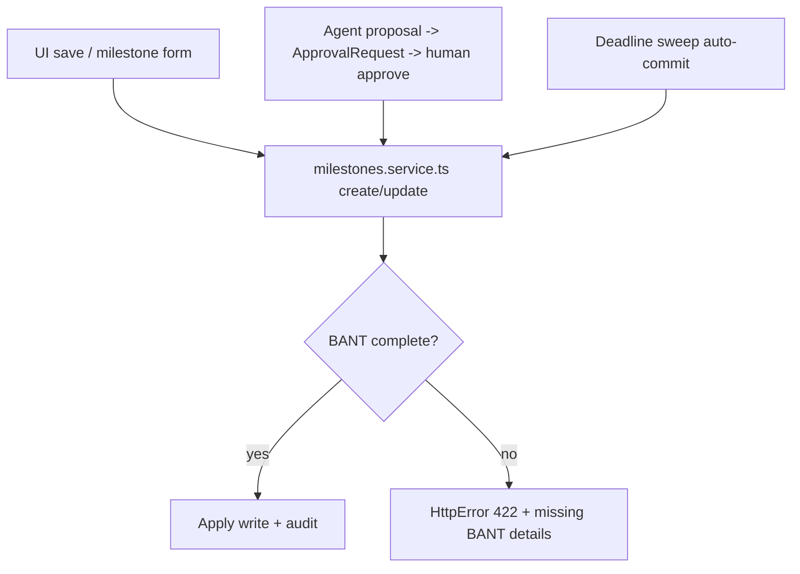
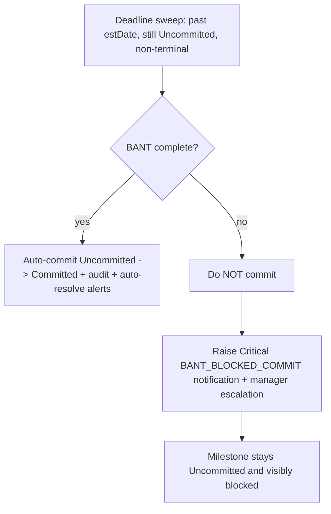

# Feature Design: BANT-Gated Milestone Progression + Deadline Alerts

> **Status:** Proposed (not yet built) · **Branch:** `merve-features` (now merged into `main`) · **Last refined:** 2026-08-13
>
> **How to resume:** This is a grounded design, not code. Nothing here is implemented yet.
> Every code reference below was verified against the current branch (see
> [§12 Verified code anchors](#12-verified-code-anchors)). Recommended first build step:
> **P1 — the hard gate** (§11), so the block is demoable before layering on the deadline sweep.
>
> **Also inside:** [§14 Broader roadmap](#14-broader-roadmap--additional-candidates-same-merve-sync)
> captures the other enhancement ideas from the same sync (CSA visibility, milestone intelligence,
> partner/duplicate, Unified capture, transcript intelligence); [§15](#15-collaboration--next-steps-from-the-sync)
> has the follow-up commitments.
>
> **Wider context:** [`stakeholder-feedback-roadmap.md`](./stakeholder-feedback-roadmap.md) merges
> this doc's §14/§15 with the later Janet / Rachel / Jeff syncs into one prioritized gap register,
> and marks every item against what is actually built on `main` today. The BANT gate below is
> item **B4** there — still the recommended next build.

---

## 1. Summary (TL;DR)

Block a milestone from **committing or completing** until **B**udget / **A**uthority / **N**eed /
**T**imeline are captured, and make sure nobody is surprised by a deadline: proactively warn as the
target date (`estDate`) approaches and escalate when it passes.

The important realization: **BANT is already ~80% built** in this codebase as a *read-only score*.
The gap Merve is describing is **enforcement at progression** — plus tying that enforcement to the
**deadline lifecycle** so "past due" never means "silently committed with gaps."

Chosen posture (per the last decision): **hard gate** — block the transition until BANT is complete
(no soft override), unified with approaching/overdue deadline notifications.

---

## 2. Problem & context

**Origin (Merve's ask):** qualification information is not documented consistently. Before a milestone
progresses, the team should know:

- **Business need** — why the customer is doing this
- **Authority / ownership** — who owns it
- **Budget** — is there money behind it
- **Timeline** — when it needs to land

**Expected value:** the handoff to CSAs, customer success managers, and delivery teams carries enough
business context to execute — no "blind handoffs."

**Committed action:** a feature that (a) validates required qualification data, (b) identifies what's
missing, (c) warns the user before commitment, and (d) folds BANT-style checks into milestone
readiness.

---

## 3. Key insight — BANT is already ~80% built, it just doesn't *enforce*

The four BANT checks already exist as **deterministic, read-only scoring**, mapped to fields that
already exist (no new tables/columns):

| BANT | Existing field(s) checked | Where |
| --- | --- | --- |
| **Budget** | `Opportunity.estimatedRevenue` > 0 OR `Milestone.fitCharge` > 0 | `lib/handoffReadiness.ts`, `lib/milestoneHandoff.ts` |
| **Authority** | `Opportunity.aeOwner` / a `DealTeamMember` / `Milestone.owner` | same |
| **Need** | `Opportunity.businessProblem` OR `Milestone.workload` | same |
| **Timeline** | `Opportunity.closeDate` OR `Milestone.estDate` | same |

`scoreMilestoneHandoff()` (`lib/milestoneHandoff.ts`) even emits a paste-ready **"CSA Handoff Notes"**
scaffold containing a `BANT:` block, exposed at `GET /api/milestones/:id/handoff-readiness` and via the
agent tool `get_milestone_handoff_readiness`.

**But it's advisory only — a pure scoring function that never throws, so it never blocks a save.**
That is exactly the gap: *validate + identify + warn* exist; **enforce before progression** does not.

---

## 4. Goals & non-goals

**In scope**
- Hard block on progression (commit/complete) until BANT is captured.
- A live BANT checklist the form can render and refresh.
- Approaching / overdue deadline notifications + escalation.

**Non-goals**
- **No new tables/columns** — honors the 11-table rule; BANT reads existing fields, alerts reuse
  `AgentNotification`.
- No gate on **terminal** transitions — `Cancelled`, `Lost To Competitor`, `Hygiene/Duplicate` never
  need BANT.
- No agent self-writes — agents stay approval-gated.
- Status/commitment values stay free strings that mirror the workbook; the gate is **service logic**,
  not a DB constraint. Mock banner preserved.

---

## 5. Design principle — one choke point

Every progression path funnels through **`apps/api/src/services/milestones.service.ts`**:

- the **UI save**,
- the **agent-approved write** (the deferred `UpdateMilestone` executed when a human approves an
  `ApprovalRequest`), and
- the **time-sweep auto-commit** (`milestoneCommitment.service.ts`).

So the gate lives there **once** and every path inherits it.

**We already have the precedent.** `milestones.service.ts` already hard-blocks a transition today:
`assertCompetitorForLostStatus()` (`lib/lostToCompetitor.ts`) throws if you set status
`Lost To Competitor` without a competitor, and it's called from both `create()` and `update()`. The
BANT gate is the **same pattern, generalized**.

---

## 6. Part A — BANT completion gate (hard block)

**Trigger — what "progression" means.** The gate fires only when a write results in:

- `customerCommitment: Uncommitted -> Committed`, **or**
- `milestoneStatus -> Completed`.

All other edits (and terminal statuses) pass untouched — reuse the existing "touched-or-existing"
field resolution already in `update()`.

**BANT definition — reuse the existing field mapping** (no new columns):

| Check | Passes when |
| --- | --- |
| **Budget** | `Milestone.fitCharge` > 0 OR `Opportunity.estimatedRevenue` > 0 |
| **Authority** | `Milestone.owner` set OR a `DealTeamMember` exists |
| **Need** | `Milestone.workload` set OR `Opportunity.businessProblem` set |
| **Timeline** | `Milestone.estDate` set OR `Opportunity.closeDate` set |

**Enforcement points**
1. **New pure module** `lib/bantReadiness.ts` → `scoreBant(ctx)` returning
   `{ complete, missing[], present[] }`. Lift the four checks out of `milestoneHandoff.ts` so both
   share one source of truth. Deterministic, no writes — mirrors `handoffReadiness.ts`.
2. **New guard** `lib/bantGate.ts` → `assertBantReady(resultingStatus, resultingCommitment, bant)`
   that throws `HttpError(422, …)` — modeled 1:1 on `assertCompetitorForLostStatus`.
3. **Wire into** `milestones.service.ts` `create()` and `update()`, right beside the existing
   competitor assertion.
4. The 422 error carries structured `details.missing[]` (each: `item`, `whatsMissing`, `howToFix`,
   reusing the shape `handoffReadiness.ts` already returns) so the UI renders the checklist **without a
   second call**.

**Agent / approval path.** Because the same service method executes the deferred `UpdateMilestone`
when a human approves an `ApprovalRequest`, an approved-but-BANT-incomplete action is **still blocked**.
Additionally, surface BANT status **on the approval card** so the approver sees the gaps *before*
deciding. The agent never commits directly — unchanged.

**API surface.** Add `GET /api/milestones/:id/bant-readiness` (mirrors the existing `handoff-readiness`
route) so the form can render/refresh the checklist live and pre-flight the Save button.

---

## 7. Part B — Deadline lifecycle notifications

**Data — reuse `AgentNotification`** (table #8), no new columns. Verified fields:
`severity`, `notifyRole`, `message`, `status`, `reasonCode`, `relatedMilestoneId`, `opportunityId`,
`createdDate`.

**Thresholds (env-configurable, deterministic):**

| Window (vs `estDate`) | Severity | reasonCode |
| --- | --- | --- |
| ≤ 7 days | `Warning` | `DEADLINE_APPROACHING` |
| ≤ 2 days / due today | `Critical` | `DEADLINE_IMMINENT` |
| past due | `Critical` | `DEADLINE_PASSED` |
| past due **and** BANT incomplete | `Critical` | `BANT_BLOCKED_COMMIT` |

**Engine — extend the sweep that already exists.** `startCommitmentSweep()` in
`milestoneCommitment.service.ts` already runs at startup + every 60s (unref'd). Broaden it into a
**milestone health sweep**: for each non-terminal milestone with an `estDate`, emit/resolve the
notification for its bucket and handle the overdue case (Part C).

**Dedup & resolution (no new table).** Before inserting, check for an open `AgentNotification` with the
same `relatedMilestoneId` + `reasonCode` in the current day-bucket; drive `status`
(`New -> Acknowledged -> Resolved`) to avoid spam. **Auto-resolve** once the milestone commits or BANT
is completed.

**Escalation.** Reuse the Graph manager-email path in `managerNotifications.service.ts` for
`Critical`/overdue. Every emit is audited via `recordAgentAction` (system actor), exactly like the
existing auto-commit flip.

---

## 8. Part C — The critical interaction (where A + B unify)

Today `milestoneCommitment.service.ts` **auto-commits** `Uncommitted -> Committed` the moment `estDate`
passes (a system sweep, deliberately not approval-gated). With a hard BANT gate, that path would
**silently bypass qualification**. New rule:

So the deadline sweep **becomes the notification engine**, and the gate makes "past-due" mean
**"escalate + block,"** never "silently commit with gaps."

> Note: because the sweep only acts on milestones that already have a *past* `estDate`, the **Timeline**
> check is always satisfied on this path — the realistic gaps here are Budget / Authority / Need.

---

## 9. UX walkthrough (state by state)

1. **Editing** — the milestone form shows a live `B · A · N · T` chip (green when present, amber with
   the missing letters) + a deadline pill; each amber letter expands to `whatsMissing` / `howToFix`.
2. **Approaching (≤ 7d)** — amber "Due in 3d" pill + a `Warning` in the notification bell; the SE is
   nudged to finish BANT early.
3. **Commit / Complete with gaps** — **blocked**: a modal lists the missing BANT items with fixes;
   **Add details now** prefills the comments block from the `suggestedDescription` scaffold. No
   override (hard gate).
4. **Overdue + incomplete** — red "Overdue — commit blocked" pill; `Critical` notification + manager
   email; surfaces in a **Needs Qualification** filter / dashboard tile.
5. **BANT completed** — the gate opens; the SE commits/completes, or the next sweep auto-commits a
   past-due one and **auto-resolves** its alerts.

---

## 10. Governance & guardrails

- **11 tables intact** — BANT reads existing fields; alerts use `AgentNotification`; every system
  action is audited.
- **Single service choke point** ⇒ UI, agent-approval, and sweep all enforce identically.
- Agent still **cannot self-commit**; the approval card shows BANT + deadline status.
- Statuses stay free strings (mirror the workbook); the gate is service logic, **not** a DB constraint.
- Mock banner preserved; no real MSX/Dataverse data involved.

### Edge cases
- **No `estDate`** → Timeline fails (so it can't commit) and it's excluded from deadline alerts until a
  date is set.
- **Terminal statuses** bypass the gate (you can always Cancel / mark Lost).
- **Backdated `estDate` created as Committed** → the gate runs on `create()` too.
- **Notification storms** → controlled by day-bucket dedup + auto-resolve.

---

## 11. Phased rollout / files touched

| Phase | Scope | Files |
| --- | --- | --- |
| **P1 — Gate** | Hard block on progression (demoable) | new `lib/bantReadiness.ts`, new `lib/bantGate.ts`, wire into `services/milestones.service.ts`, extend `updateMilestoneSchema` in `validators/schemas.ts`, add `bant-readiness` route + controller, sync OpenAPI |
| **P2 — Alerts** | Deadline sweep + notifications | extend `services/milestoneCommitment.service.ts` sweep, `AgentNotification` write/resolution, manager escalation via `managerNotifications.service.ts` |
| **P3 — UI** | Surfaces | BANT chip + deadline pill + block modal in `OpportunityDetail.tsx` / milestone form, notification bell, Needs-Qualification filter |
| **P4 — Polish** | Governance surfaces | approval-card BANT badge, dashboard tile |

> **Transport-only fields (if a soft override is ever reintroduced):** the pattern to follow is the
> existing `MSX_ACTION::`-on-`errorMessage` trick — add optional `bantAck` / `bantOverrideReason` to the
> milestone update schema, consume them in the service, and encode them into the **audit text** rather
> than persisting new columns. For the current **hard-gate** posture this is *not* needed.

---

## 12. Verified code anchors

Confirmed present on `merve-features` @ the current HEAD while refining this doc:

| Claim | Verified anchor |
| --- | --- |
| Hard-block precedent exists | `assertCompetitorForLostStatus` in `lib/lostToCompetitor.ts`, used by `services/milestones.service.ts` (also `statusHistory`, `approvalRequests`) |
| BANT scoring + CSA handoff scaffold | `scoreMilestoneHandoff()` and the `BANT:` block in `lib/milestoneHandoff.ts` |
| Read-only readiness checklist shape | `lib/handoffReadiness.ts` — `ReadinessCheck { key, item, whatsMissing, howToFix, passed }`, keys include `budget \| authority \| need \| timeline` |
| Readiness endpoint to mirror | `GET /:id/handoff-readiness` on both `routes/milestones.routes.ts` and `routes/opportunities.routes.ts` |
| Notifications need no schema change | `AgentNotification` already has `severity`, `notifyRole`, `message`, `status`, `reasonCode`, `relatedMilestoneId`, `opportunityId`, `createdDate` |
| The sweep to extend | `startCommitmentSweep()` in `services/milestoneCommitment.service.ts` (startup + 60s, auto-commits `Uncommitted -> Committed` on past `estDate`) |

---

## 13. Open decisions to confirm before build

1. **Approaching windows / severities** — default 7d `Warning` / 2d `Critical`?
2. **Gate trigger set** — confirm it's **Committed-flip + Completed** only (not every forward status
   move).
3. **Notify roles + manager email escalation** — which roles, and is email on for `Critical`?
4. **Past-due-with-gaps behavior** — confirm Part C should *hold* the milestone as Uncommitted +
   escalate (recommended), rather than commit-with-a-flag.

---

### Next step
Build **P1 (the hard gate)** first so the block is demoable, then layer on the P2 deadline sweep.

---

## 14. Broader roadmap — additional candidates (same Merve sync)

The BANT gate above (Parts I, §§1–13) was the first concrete feature. The same conversation surfaced
six more enhancement ideas. They're captured here as **future candidates** — most are discovery-stage,
not committed designs — each tied back to what already exists in this codebase and to the project's
hard rules (**exactly 11 tables**, **business data stays synthetic/mock**, **real Entra + Graph allowed
under Option B**, **every governed write stays approval-gated and audited**).

### 14.1 CSA visibility before handoff

- **Problem.** CSAs are often looped in only *after* a milestone is committed — yet sizing, deployment
  planning, and technical validation need CSA input earlier.
- **Proposal.** Surface upcoming milestones to CSAs *before* commitment: notify the CSA role when a
  milestone enters the approaching-deadline window or is proposed for commitment, give CSAs a read view
  of pre-sales milestones on the opportunity, and attach the existing handoff-readiness summary to that
  early notification.
- **Value.** CSAs join before commitment and can catch issues before deployment planning begins — no
  "surprise committed milestone."
- **Fits this codebase.** A direct extension of Part B/C: reuse `AgentNotification.notifyRole` to target
  CSAs, firing on the approaching-deadline bucket and on any agent-proposed `UpdateMilestone` that would
  commit. The pre-handoff summary is already produced by `scoreMilestoneHandoff()` / the
  `handoff-readiness` endpoint. CSA identity/role can come from Entra/Graph (Option B), audited via
  `recordAgentAction`. **No new tables.**
- **Stage / size.** Small once P2 (the alert sweep) exists — largely a `notifyRole` + threshold addition.

### 14.2 Automatic milestone intelligence

- **Problem.** Leaders open milestones one-by-one to piece together status, ownership, blockers, sizing,
  last update, and commitment state.
- **Proposal.** Expand the dashboard + milestone agent to produce on demand: concise per-milestone
  summaries, a **blocked-milestones** report, status roll-ups, ownership tracking, and update history.
- **Value.** Less time hunting through records, more time resolving the actual blockers.
- **Fits this codebase.** Update history already lives in **`MilestoneStatusHistory`** (table #3);
  roll-ups can be persisted in **`DashboardMetricSnapshot`** (table #11); blocker/risk data is embedded
  on `OpportunityMilestone` (there is deliberately **no blocker table** — 11-table rule). Expose as read
  endpoints + an agent read tool (mirroring `get_milestone_handoff_readiness`); the summaries are
  generated text, not stored business data. **No new tables.**
- **Stage / size.** Medium; read-only, so the read paths need no approval-gating.

### 14.3 Partner visibility *(constrained)*

- **Problem.** When a partner delivers, Microsoft teams may have limited insight into partner activity,
  progress, delays, and risk — and partner delays cause milestone slippage that hits quarterly outcomes.
- **Proposal (discovery).** Explore what partner information already exists on the record, whether
  partner status can be surfaced on the milestone/opportunity, and how partner-related delay/risk could
  feed the agent's at-risk reporting.
- **Value.** Better insight into shared-delivery projects.
- **Fits this codebase — key constraint.** The hard rules **forbid a `Partner` table** (and forbid real
  partner/MSX data). Partner context must live in **embedded fields on `Opportunity` /
  `OpportunityMilestone`** and stay **synthetic/mock**. So this is scoped to: surface existing embedded
  partner/risk signal and fold it into at-risk reporting (14.2) and deadline escalation (Part B) —
  *not* a new partner entity and *not* a real partner-system integration.
- **Stage / size.** Discovery first (confirm which embedded fields carry partner signal), then small,
  folded into 14.2.

### 14.4 Duplicate milestone detection

- **Problem.** Duplicate milestones occasionally exist, creating confusion over which one is the
  system-of-record for execution and reporting.
- **Proposal.** Have the agent detect likely duplicates (same opportunity + similar
  name/workload/category), flag them, surface the inconsistency, and help the user pick the active one —
  proposing the loser be marked with the existing **`Hygiene/Duplicate`** status.
- **Value.** Cleaner pipeline management, less reporting confusion.
- **Fits this codebase.** Milestones already carry a `@unique` `milestoneBusinessId`, and
  **`Hygiene/Duplicate` is already a recognized terminal status** (it's in the commitment sweep's FROZEN
  set). Detection is a read-only heuristic; any resolution (marking one `Hygiene/Duplicate`) flows
  through the **approval gate** as a deferred `UpdateMilestone` and is audited — never auto-applied.
  **No new tables.**
- **Stage / size.** Small–medium; a detection heuristic + a recommendation/approval surface.

### 14.5 Unified opportunity capture

- **Problem.** CSAs spot new opportunities during delivery but rarely record them — the Unified creation
  process is administrative overhead they deprioritize, even though leadership wants them tracked.
- **Proposal (discovery).** Merve to walk through the Unified process (how opportunities are created
  today, the pain points, where automation helps). Then evaluate letting the agent *draft* an
  opportunity from delivery context for one-click human approval.
- **Value.** Opportunities captured during engagements instead of lost.
- **Fits this codebase.** The agent **already** supports `CreateOpportunity` as an approval-gated
  deferred action, so the enforcement pattern exists — this item is about lowering capture friction.
  Business data stays **mock**; every create stays **human-approved** and audited. **No new tables.**
- **Stage / size.** Discovery-gated (needs Merve's process detail) → then medium.

### 14.6 Meeting-transcript intelligence (Graph / Teams)

- **Problem.** Key customer context is discussed in meetings but never reaches the system of record;
  CSAs lack time to hand-document opportunities, milestone updates, and customer requests.
- **Proposal (forward-looking).** Let the agent read Teams meeting transcripts via Graph to detect
  candidate opportunities, extract action items, spot milestone-related discussion, and surface customer
  context — turning conversation into structured drafts. *(Merve flagged strong interest.)*
- **Value.** Converts tribal/meeting knowledge into structured business records with far less manual
  effort.
- **Fits this codebase — Option B rules apply.** This is exactly the **authorized real integration**:
  Entra sign-in + Graph (Teams/Outlook) *are* allowed. Guardrails are mandatory — every Graph read is
  **gated behind an authenticated user** and **audited via `recordAgentAction`**; **real Graph data is
  never persisted into the 11 mock tables**; and anything the agent proposes (new opportunity, milestone
  update) goes through the **approval gate** as a recommendation / `ApprovalRequest`, never a direct
  write.
- **Stage / size.** Large — the marquee forward-looking item. Sequence it *after* the gate + alerts so
  there's already a governed write path for whatever a transcript proposes.

---

## 15. Collaboration & next steps (from the sync)

Captured so the thread can resume after Merve is back.

**Merve to provide**
- A detailed walkthrough of the **Unified** opportunity process (current creation flow + pain points).
- Clarification on **CSA workflows**.
- Continued input on automation opportunities.
- Review of the final project materials + recording.

**Amanda to drive**
- Document all findings (this doc).
- Continue the **readiness-validation** concept — the BANT gate, §§1–13 above.
- Research the **Unified** opportunity process (14.5).
- Investigate **transcript-driven** automation (14.6).
- Produce a **roadmap of future enhancements** before end of internship (this §14).
