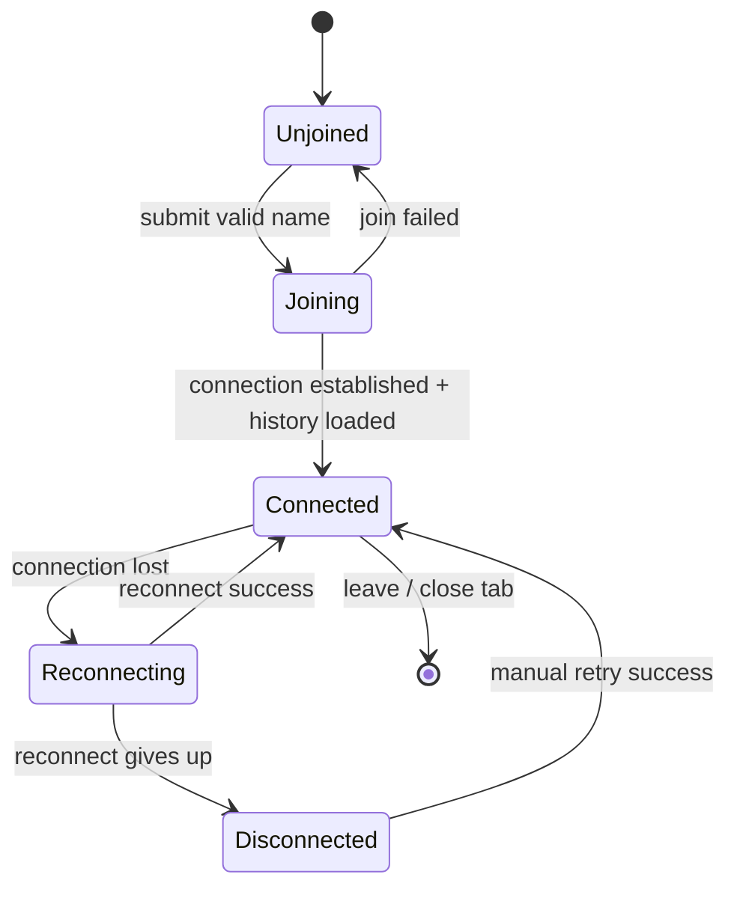
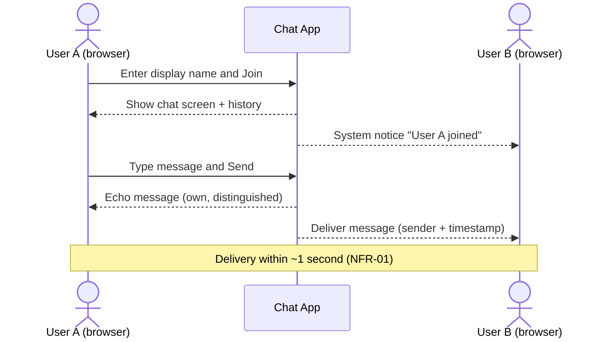

# Functional Specifications — Team Chat Application

**Artifact:** Functional Specifications
**Stage:** 3 of 7 (Exercise 2)
**Status:** Final (generated by Claude Opus, critiqued, updated)
**Builds on:** chatapp.assumptions.md, chatapp.requirements.md

---

## Purpose

This document describes what the system does from the user's perspective: the
user-facing features, screens, interactions, states, and rules. It does not
describe internal implementation (that is the architectural specification). Each
feature traces to the functional requirements it satisfies.

---

## 1. Personas

| Persona | Description | Goals |
|---------|-------------|-------|
| Team Member | Any trusted internal user who wants to chat. | Join quickly, read the conversation, post messages, see who is around. |

There is no administrator or moderator role in the MVP.

---

## 2. User-Facing Features

### 2.1 Join the Chat (FR-01, FR-02)

- On first load, the user sees a **Join** screen with a single text input for a display name and a **Join** button.
- The Join button is disabled until a non-empty, non-whitespace name is entered.
- On join, the user transitions to the **Chat** screen and is added to the shared room.
- Invalid names (empty/whitespace) produce an inline validation message and block joining.

### 2.2 Shared Chat Room (FR-03, FR-04, FR-05)

- All team members participate in one shared room.
- A message composer (text input + **Send** button) sits at the bottom of the screen.
- Sending a message broadcasts it to all connected users in near real time.
- Each message row shows: sender display name, message text, and a timestamp (local time, e.g., `HH:mm`).
- The user's own messages are visually distinguished (e.g., right-aligned or accent color).

### 2.3 Message History (FR-06)

- When a user joins, the room's recent in-session message history is loaded and displayed in chronological order.
- History is session/runtime scoped; it is not durably persisted in the MVP.

### 2.4 Presence Notifications (FR-07, FR-08, FR-12)

- A system notification line appears in the message stream when a user joins ("<name> joined the chat").
- A system notification line appears when a user leaves ("<name> left the chat").
- The header SHOULD display the current connected-user count.

### 2.5 Message Composition Rules (FR-09, FR-10, FR-13)

- Empty/whitespace-only messages are ignored (Send does nothing).
- Messages longer than the maximum length (2000 characters) are rejected with an inline message.
- Message content is sanitized/encoded so embedded markup or scripts render as plain text.

### 2.6 Auto-Scroll and Reconnect (FR-11, FR-14)

- The message list auto-scrolls to the newest message when a new message arrives, unless the user has scrolled up to read history.
- If the connection drops, the client shows a "Reconnecting…" indicator and automatically attempts to reconnect; on success it resumes and shows a "Connected" state.

---

## 3. Screen Specifications

### 3.1 Join Screen

| Element | Type | Behavior |
|---------|------|----------|
| Display name input | Text field | Required; trims whitespace; max ~50 chars. |
| Join button | Button | Disabled until valid name; submits to enter room. |
| Validation message | Inline text | Shown when name is invalid. |

### 3.2 Chat Screen

| Element | Type | Behavior |
|---------|------|----------|
| Header | Bar | Shows app title, room name, connection status, user count. |
| Message list | Scrollable list | Shows history + live messages; auto-scrolls. |
| Message row | List item | Sender, text, timestamp; own messages distinguished. |
| System notice | List item | Join/leave notifications, visually distinct. |
| Message input | Text field | Enter or Send to submit; cleared after send. |
| Send button | Button | Disabled when input is empty. |
| Connection indicator | Status chip | Connected / Reconnecting / Disconnected. |

---

## 4. State Model (Client)

---

## 5. Primary User Flow — Send and Receive a Message

---

## 6. Business Rules

| ID | Rule | Traces to |
|----|------|-----------|
| BR-01 | A display name is required to join; empty/whitespace is invalid. | FR-01, FR-02 |
| BR-02 | Messages are plain text; max 2000 characters. | FR-09, FR-13 |
| BR-03 | Empty/whitespace messages are not sent. | FR-10 |
| BR-04 | Every message is attributed with sender and timestamp. | FR-05 |
| BR-05 | History shown to joiners is limited to the current runtime session. | FR-06, A-22 |
| BR-06 | All rendered user content is sanitized/encoded. | FR-13, NFR-06 |

---

## 7. Error and Edge Cases

| Case | Expected Behavior |
|------|-------------------|
| Network drop mid-session | Show "Reconnecting…", auto-retry, resume on success. |
| Send while disconnected | Disable send or queue until reconnected; show status. |
| Duplicate display name | Allowed in MVP; names are not unique (documented limitation). |
| Very long message | Rejected with inline validation before sending. |
| Markup/script in message | Rendered as inert text (sanitized). |
| Server restart | In-memory history is lost; clients reconnect to an empty room (documented MVP limitation). |

---

## 8. Traceability Summary

Each feature in Section 2 and each business rule in Section 6 references the
functional requirement(s) it satisfies, which in turn trace to the assumptions.
The test cases artifact verifies these features and rules.
